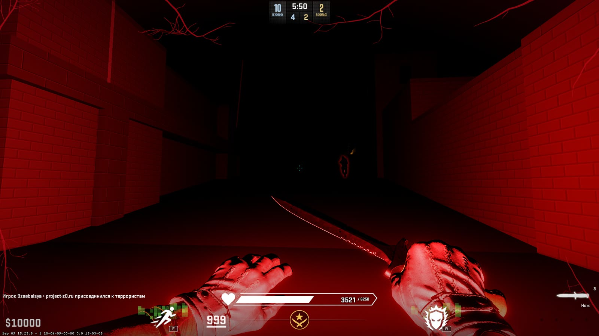
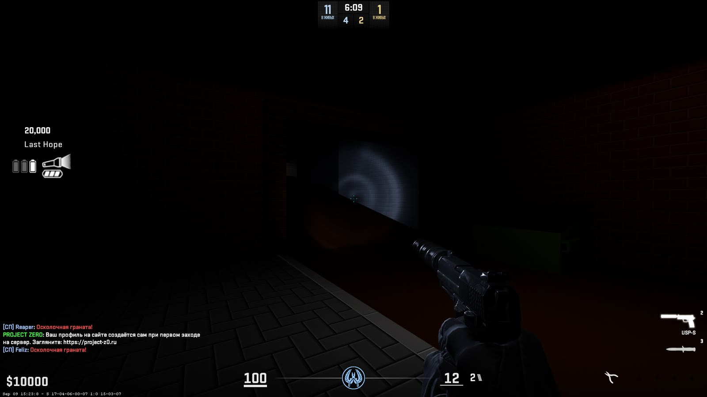
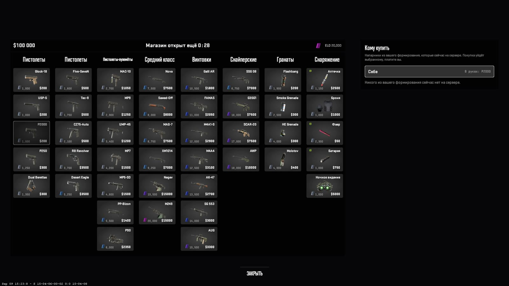

# CS2 Zombie Mode

A zombie infection mode for **Counter-Strike 2**, built on [CounterStrikeSharp](https://github.com/roflmuffin/CounterStrikeSharp).
Open source, modular, and ready to be extended — by you or by your AI assistant.

A bite does not turn you. It makes you bleed.

## How a round plays

- **Nobody knows who.** The round starts with everyone human. One player is already infected — and does not know
  it yet. They turn at a random moment; the fewer humans are alive, the sooner.
- **Bites bleed.** A zombie's hit does not convert a human outright. It opens a wound: health drains, every new
  bite makes it drain faster. Get to cover and use a medkit (Medi-Shot) to stop the bleeding. At 0 HP you turn.
- **The first infected is different.** More health, less knockback, a long leap (E) and a one-second berserk (R)
  during which nothing can hurt them.
- **Zombies are real threats.** Health scales with the number of humans, zombies regenerate when they are left
  alone, and they cannot pick up guns. They are tinted red, so you can tell who turned at a glance.
- **Knockback that feels right.** Humans push zombies away from the shooter, weapon classes push differently, a
  knife hit can save you at point-blank range.
- **Rounds end.** Humans win by killing every zombie, zombies by infecting every human. At the time limit an
  airstrike finishes the zombies off.



*The first infected on our server: 3521 of 6250 real health behind the 999 the engine can display, leap on E,
berserk on R. The red vision and this HUD are our server's own add-ons — this repository gives you the mechanics
and the hooks to build your own.*



*A night map on our server: humans play it in the dark with a flashlight and limited batteries. The flashlight is
one of our own extensions, built on the same API you get here.*

## Modules

| Plugin | What it does |
|---|---|
| `ZombieMode` | The core: the round, infection, bleeding, zombies and their abilities, knockback, win conditions. |
| `ZombieMode.Money` | Dollars for damage to zombies (1 damage = $1), for infections and kills, with a cap. |
| `ZombieMode.Magazines` | Spare magazines per weapon on purchase — the CZ75-Auto does not have to run dry in a second. |
| `ZombieMode.WeaponDamage` | Per-weapon damage multipliers against zombies, tuned on a live server. |

Each extension is a separate plugin: remove the ones you do not want, replace them with your own.



*Our own round shop, built on top of the core: opens on B before the outbreak and can buy for a teammate. It is not
in this repository — the Money extension works with the stock buy menu — but the technique is open:
[cs2-hud-panel](https://github.com/nvmxre/cs2-hud-panel).*

## Install

Requirements: a CS2 dedicated server with [Metamod:Source](https://www.sourcemm.net/) and
[CounterStrikeSharp](https://github.com/roflmuffin/CounterStrikeSharp) 1.0.374 or newer.

1. Download the latest release zip.
2. Copy its `addons` folder over `game/csgo/addons` on your server.
3. Add the sound addon (see [Sound](#sound)).
4. Start the server. Configs appear in `addons/counterstrikesharp/configs/plugins/<Plugin>/<Plugin>.json`.

Build from source instead: `./build.sh` (needs the .NET 10 SDK), then copy `dist/addons`.

## Sound

Growls, pain and death from the zombie's position, a heartbeat while you bleed, a countdown to the first infection,
round start and round end music, ambience. The sounds reach players as a Workshop addon —
[CS2 Zombie Mode — Sound Pack](https://steamcommunity.com/sharedfiles/filedetails/?id=3806882583) (ID `3806882583`) — through
[MultiAddonManager](https://github.com/Source2ZE/MultiAddonManager): add `3806882583` to `mm_extra_addons`.
Details in [sounds/README.md](sounds/README.md).
Every event name is in the config, so you can swap in your own sounds.

## Configure

Every setting is documented in the config classes (`src/ZombieMode/Config`). The ones people change first:

| Key | Default | Meaning |
|---|---|---|
| `infection.hpBase`, `hpPerHuman`, `hpCap` | 1500, 100, 6000 | Zombie health: base plus per human alive, capped |
| `infection.firstInfectedMultiplier` | 2.5 | First infected health multiplier |
| `infection.bleedDamage`, `bleedInterval` | 5, 1.0 | Bleeding: HP per tick and seconds between ticks |
| `infection.roundLimitSeconds` | 420 | Round time limit before the airstrike |
| `knockback.multiplier` | 6 | Overall knockback strength |
| `cvars` | … | Console variables applied every map and round |

Player-facing text is in `plugins/ZombieMode/lang/<language>.json` — English and Russian included. A new
language is a new json file.

## Write your own plugins with AI

This repository is set up so that an AI coding assistant can write working extensions for it.

- **[AGENTS.md](AGENTS.md)** — read automatically by Claude Code, Codex, Cursor and Copilot. It explains the
  `IZombieCore` contract, how extensions are built and deployed, and **the CS2 traps that crash servers**:
  damage hooks, model precache, hot reload leftovers, entities before map load. We learned each of them the hard
  way on a live server; your assistant does not have to.
- **[templates/extension](templates/extension)** — a minimal extension that builds on the first try.
- **A Claude Code skill** ([`.claude/skills/new-extension`](.claude/skills/new-extension/SKILL.md)) — scaffolds,
  wires and checks a new extension end to end.
- **The three extensions** in `src/` are small, commented reference implementations.

Try it: open this repository in your assistant and ask

> Write a cs2-zombie-mode extension that gives the last human alive +50 armor and announces it.

## API in 30 seconds

```csharp
public override void OnAllPluginsLoaded(bool hotReload)
{
    var core = ZombieModeCapabilities.Core.Get()!;
    core.Infected += e => Server.PrintToChatAll($"{e.Victim.PlayerName} has turned");
    core.ZombieDamaged += e => { /* e.Attacker dealt e.Damage to e.Victim */ };
    core.AddDamageModifier(new MyModifier());       // change damage humans deal to zombies
}
```

The full contract is one file: [`src/ZombieMode.Api/IZombieCore.cs`](src/ZombieMode.Api/IZombieCore.cs).

## Related

- **[cs2-hud-panel](https://github.com/nvmxre/cs2-hud-panel)** — our library for clickable, flicker-free HUD
  panels in CS2 (`custom_hud_layout`), opened with the stock B key. Shops, zombie HUDs, menus: the natural next
  extension for this mode. MIT.

## Play it

This mode runs on the **Project Zero** servers — a CS2 project about the first day of an outbreak, with units,
shared bases and a whole world around the round: [project-z0.ru](https://project-z0.ru) ·
`connect s1.project-z0.ru:27015`.

## License

- The core and extensions: [GPL-3.0](LICENSE), like CounterStrikeSharp itself.
- The API contract (`src/ZombieMode.Api`): [MIT](src/ZombieMode.Api/LICENSE), so your plugins can use any license.
